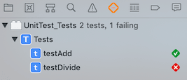
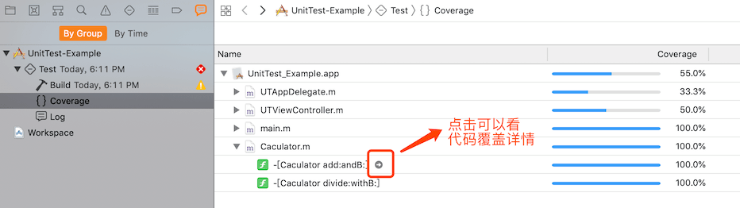

iOS 自动化测试


### 1.基础测试

#### 1.1添加需要测试代码

添加需要测试的代码，实现的是 int 类型的加法和除法

```objc
@interface Caculator : NSObject

- (int)add:(int)a andB:(int)b;

- (int)divide:(int)a withB:(int)b;

@end
    
@implementation Caculator

- (int)add:(int)a andB:(int)b {
    return a + b;
}

- (int)divide:(int)a withB:(int)b {
    return a / b;
}

@end
```


#### 1.2添加测试代码

新建 target - iOS Unit Testing Bundle，在 tests.m 中实现以下代码

```objc
@interface Tests : XCTestCase
@property(nonatomic, strong) Caculator *caculator;
@end

@implementation Tests

- (void)setUp {
    [super setUp];

     self.caculator = [Caculator new];
}

- (void)tearDown {
    // Put teardown code here. This method is called after the invocation of each test method in the class.
    [super tearDown];
}

- (void)testAdd {
    int add = [self.caculator add:1 andB:2];
    XCTAssertEqual(add, 3);
}

- (void)testDivide {
    int divide = [self.caculator divide:3 withB:2];
    XCTAssertEqual(divide, 1.5);
}
@end
```


#### 1.3进行测试

点击测试按钮，可以看到测试结果，除法测试是失败的，因为正确的值应该为 1




### 2.测试覆盖率

#### 2.1 开启 Coverage


#### 2.2 执行测试代码

执行测试代码后可以按一下方法查看测试覆盖率




### 3. Jenkins 集成自动化测试

#### 3.1 安装 jenkins

自行安装

#### 3.2 安装 [OCUnit2JUnit](https://github.com/ciryon/OCUnit2JUnit)

> A script that converts output from OCUnit in xcodebuild to the XML format used by JUnit. This allows for XCode builds on continuos integration servers like Jenkins, complete with test reports!

```
sudo gem install ocunit2junit -n /usr/local/bin
```

#### 3.3 安装 [slather](https://github.com/SlatherOrg/slather)

> Generate test coverage reports for Xcode projects & hook it into CI.

```
sudo gem install slather -n /usr/local/bin
```

#### 3.4 配置 jenkins

